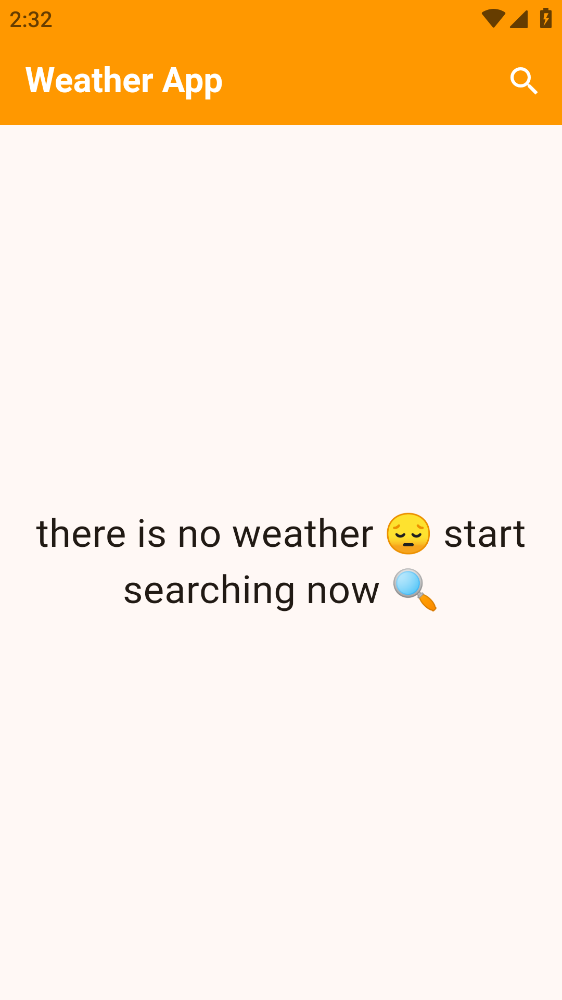
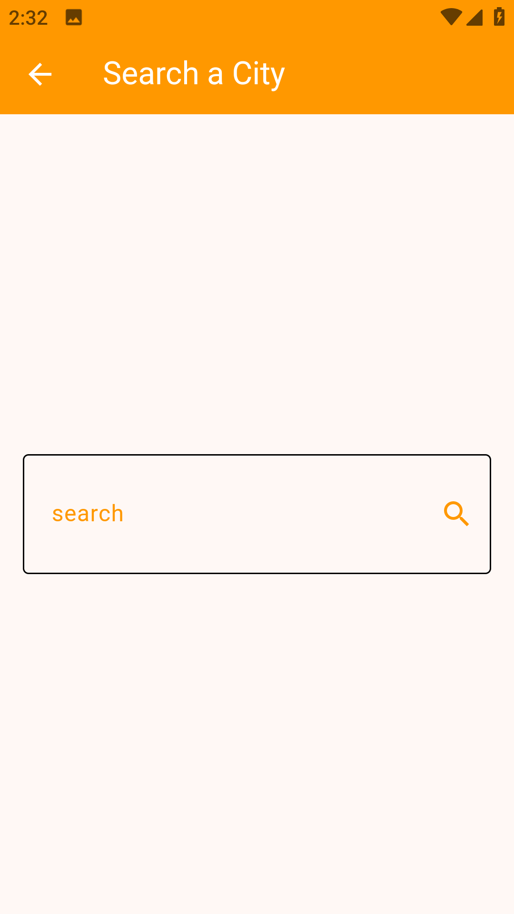
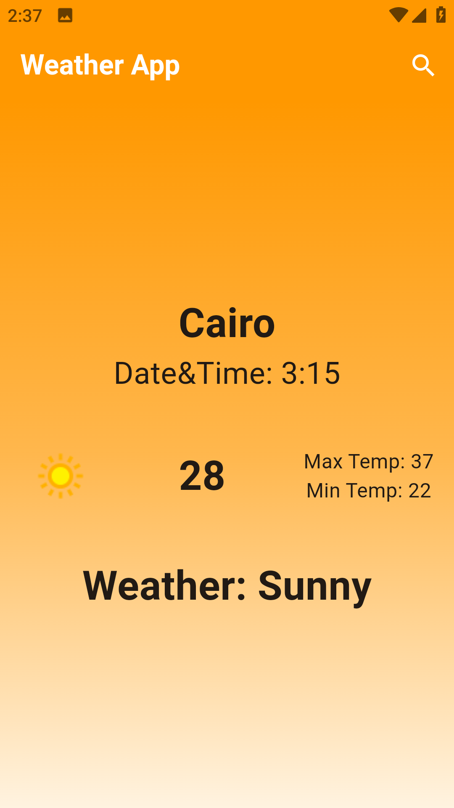

# 🌤️ Weather App

A Flutter app that shows real-time weather data for any city.

## ✨ Features
- Search weather by city name
- Shows temperature, humidity, and conditions
- Clean and simple UI

## 🛠️ Tech Stack
- Flutter & Dart
- REST API & Dio
- OpenWeatherMap API

## 📸 Screenshots
## 📸 Screenshots

## 🚀 Getting Started
1. Clone the repo
2. Run `flutter pub get`
3. Add your API key in the code
4. Run `flutter run`
